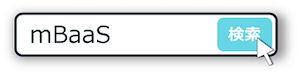
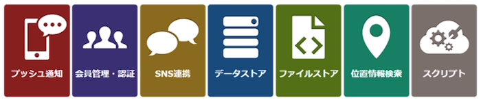
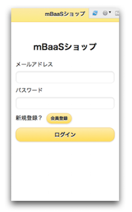

name: inverse
layout: true
class: center, middle, inverse
---
# <span style="font-size: 30%">【Monaca編】ニフティクラウドmobile backend レベルアップセミナー</span><br>クーポン配信アプリ<br>を作ろう！</span>

@ncmbadmin

.footnote[
20160817作成
]
---
layout: false
## 事前準備
ニフティクラウドmobile backendのアカウント登録がお済みでない方は、<br>
[ホームページ](http://mb.cloud.nifty.com/about.htm)右上にある「無料登録」ボタンをクリックして、<br>
アカウント登録を実施してください




---
## 今回のハンズオンセミナーについて
### セミナーの形式

.left-column[
  .center[
  150分でアプリ完成させます
  
  ]
]
.right-column[
  .center[
  講義形式で説明と演習を繰り返して<br>アプリを作成します<br><br>
  
  ]
]


---
## 今回のハンズオンセミナーについて
### 学ぶ内容

「mBaaS Shop List」アプリの作成を通して、アクティブユーザー率を上げる<br>
効率的なプッシュ通知の組み込み方を学びます

.center[

]

---
## 今回のハンズオンセミナーについて
### 学ぶ内容

「mBaaS Shop List」アプリの作成を通して、アクティブユーザー率を上げる<br>
効率的なプッシュ通知の組み込み方を学びます<br>

.center[

]

---
## 今回のハンズオンセミナーについて
### 学ぶ内容

「mBaaS Shop List」アプリの作成を通して、アクティブユーザー率を上げる<br>
効率的なプッシュ通知の組み込み方を学びます<br><br>

.center[

]

---
## ニフティクラウド mobile backendとは
### サービス紹介

* スマホアプリで汎用的に実装される機能を、クラウドサービスとして提供しているサービスです
 * 通称「mBaaS」
* Monaca環境も対応しており、JavascriptSDKを利用することで上記の機能を簡単に実装できます

.center[

]

---
## ニフティクラウド mobile backendとは
### Javascript SDKの特徴

* SDKのインストールが必要　（済み）
  * 今回は実装済み
  * 参考：[クイックスタート](http://mb.cloud.nifty.com/doc/current/introduction/quickstart_monaca.html)

---
## ニフティクラウド mobile backendとは
### Javascript SDKの特徴

* SDKの初期化処理が必要です
 * 後で処理を実装します

```js
var ncmb = new NCMB("YOUR_APPLICATIONKEY","YOUR_CLIENTKEY");
```

---
## ニフティクラウド mobile backendとは
### Javascript SDKの特徴

* サーバへリクエストする際、Javascriptは基本的に非同期処理として実行されます
* 同期処理と非同期処理
 * 同期処理はその処理が完了するまで、次の処理が実行されません
 * 非同期処理はバックグラウンドで処理を実行し、次の処理を実行します(Javascript)

---
## ニフティクラウド mobile backendとは
### Javascript SDKの特徴

* SDKの代表利用例を紹介します
    * オブジェクトを登録する
    * Promise形式で実装されています.
    * then, catchでそれぞれ成功／失敗の時の処理を定義します

```js
// クラスのBookを作成
var Book = ncmb.DataStore("Book");

// データストアへの登録
var book = new Book();
book.set("message", "Hello, NCMB!");
book.save()
    .then(function(){
          // 保存に成功した場合の処理
    })
    .catch(function(err){
          // 保存に失敗した場合の処理
    });
```


---
## ハンズオンの概要
### 作成するアプリについて

* クーポン配信アプリをイメージした「mBaaS Shop List」アプリの作成を通して、mBaaSの機能を理解していきます
* mBaaSの連携部分をコーディングし、アプリを完成させ、次の内容を実現していきます
 * 会員登録をするとお店情報を見ることができます
 * お店のお気に入り登録ができ、お気に入り登録をしたお店からプッシュ通知で届きます
 * 性別や都道府県限定のプッシュ通知ができます
 * お店からのプッシュ通知でクーポンを直接配信することができます
 * 決まった時間に通知を出すようにプッシュ通知を仕掛けることができます

---
## ハンズオンの概要
### 作成するアプリについて

.center[

]

---
## ハンズオンの流れ

### <font color="#49a7e5" size="5">前半&nbsp;</font><font size="6">「mBaaS Shop List」アプリを作ろう！</font>###

.size_large[
1. ハンズオンの準備
1. 会員管理機能の作成
1. Shop情報の設定
1. お気に入り機能の作成
]

### <font color="#49a7e5" size="5">後半&nbsp;</font><font size="6">プッシュ通知を送ろう！</font>###
.size_large[
1. プッシュ通知の準備
1. プッシュ通知を送信：セグメント配信
1. プッシュ通知を送信：リッチプッシュ
]

---
layout: true
class: center, middle, inverse_sub
---
#「mBaaS Shop List」<br>アプリを作ろう！

.size_large[
＜前半＞
]

---
layout: true
class: center, middle, inverse
---
# 1.ハンズオンの準備

---
layout: false
## ハンズオンの準備
### プロジェクトをダウンロード

下記リンクをクリックして、ZIPファイルでダウンロードしてください▼<br>
.size_large[
　　　 ### [MonacaAdvancePush](https://github.com/ncmbadmin/MonacaAdvancePush/archive/handson_version.zip)###
]

* ダウンロードしたzipファイルを、[Monaca](https://ja.monaca.io/)にインポートします

.center[

]

---
## ハンズオンの準備
### プロジェクトにあらかじめ実施していること

* mBaaSのJavascript SDKをインストール済み ( `Javascript SDK v.2.1.2` )
* mBaaSのプッシュ通知Cordovaプラグインをインストール済み ( `Monaca NCMB Push plugin v.2.0.2` )
* mBaaSとの連携以外の処理のコーディング
 * アプリのデザインを[jQuery Mobile](https://jquerymobile.com/)ベースで作成し、画面遷移、ボタン処理はコーディングしています( `index.html` )

---
## ハンズオンの準備
### mBaaSの準備

* [mBaaS](http://mb.cloud.nifty.com)にログインしてアプリを作成します


---
## ハンズオンの準備
### APIキーの設定とSDKの初期化

* `www/js/app.js`を開きます
* 一番最初に実行される処理を実装します
* 以下のコメントの直下に初期化コードを追加します

BEFORE

```js
 // 【mBaaS】 APIキーの設定とSDKの初期化
```

AFTER

```js
 // 【mBaaS】 APIキーの設定とSDKの初期化
var appKey    = "YOUR_APP_KEY";
var clientKey = "YOUR_CLIENT_KEY";
var ncmb = new NCMB(appKey,clientKey);
```

---
## ハンズオンの準備
### APIキーの設定とSDKの初期化

* 初期化処理の「`YOUR_APP_KEY`」，「`YOUR_CLIENT_KEY`」の部分をアプリ作成時に発行されたAPIキーに書き換えてください
 * APIキーは、mBaaSのダッシュボードから「アプリ設定」→「基本」にあります

.center[

]

---
layout: true
class: center, middle, inverse
---
# 2.会員管理機能の作成

---
layout: false
## 会員管理機能の作成
### mBaaSの設定

* 会員管理設定の「メールアドレス/パスワード認証」を許可します
    * 「許可する」と選択し、保存します


---
## 会員管理機能の作成

### 会員管理①：会員登録用メールを要求する[実装済み]

.center[

]


---
## 会員管理機能の作成
### 会員管理①：会員登録用メールを要求する[実装済み]

HTMLフォームコードは `index.html`にて確認できます

```html:index.html
    <!-- [2 SIGNUP] 会員ログインリクエストページ -->
    <div data-role="page" id="SignupPage" data-theme="t">
    <header data-role="header" data-position="fixed" data-theme="t">
        <h1>mBaaSショップ</h1>
    </header>
        <section data-role="content">
        <h1>新規登録</h1>    
      メールアドレス
        <input type="text" id="signup_mailaddress">  
        <a href="#" id="SignupBtn" data-role="button" data-inline="false" data-theme="e">送信</a>
        <a href="#LoginPage" data-role="button" data-mini="true" data-inline="true" data-theme="e">戻る</a>
      </section>
    </div>
```


---
## 会員管理機能の作成
### 会員管理①：会員登録用メールを要求する[実装済み]

* `app.js`の`onSignupBtn()`を開きます
* 会員登録処理を実装します[実装済み]

```js
    // 【mBaaS：会員管理①】会員登録用メールを要求する
    var mailaddress = $("#signup_mailaddress").val();
    ncmb.User.requestSignUpEmail(mailaddress)
         .then(function(data){
            // 会員登録用メールの要求成功時の処理
         })
         .catch(function(err){
            // 会員登録用メールの要求失敗時の処理
         });
```

---
## 会員管理機能の作成
### 会員管理①：会員登録用メールを要求する[実装済み]

* それぞれ処理を追記しています[実装済み]

成功時の処理

```js
            // 会員登録用メールの要求成功時の処理
            alert("リクエストを送信しました！メールをご確認ください");
            $.mobile.changePage('#LoginPage');
```

失敗時の処理

```js
            // 会員登録用メールの要求失敗時の処理
            alert("リクエスト失敗！次のエラー発生: " + err);
            $.mobile.changePage('#LoginPage');
```

---
## 会員管理機能の作成
### 会員管理②：メールアドレスとパスワードでログイン<br>[実装済み]

.center[

]

---
## 会員管理機能の作成
### 会員管理②：メールアドレスとパスワードでログイン<br>[実装済み]

HTMLフォームコードは `index.html`にて確認できます

```html:index.html
    <!-- [1 LOGIN] ログインページ -->
    <div data-role="page" id="LoginPage" data-theme="t">
        <header data-role="header" data-position="fixed" data-theme="e">
            <h1>mBaaSショップ</h1>
        </header>
        <section data-role="content">
            <center><h1>mBaaSショップ</h1></center>
                メールアドレス
            <input type="text" id="login_mailaddress">
                パスワード
            <input type="password" id="login_password">
                新規登録？
            <a href="#SignupPage" data-role="button" data-mini="true" data-inline="true" data-theme="e">会員登録</a>
            <a href="#" id="LoginBtn" data-role="button" data-inline="false" data-theme="e">ログイン</a>
        </section>
    </div>
```

---
## 会員管理機能の作成
### 会員管理②：メールアドレスとパスワードでログイン<br>[実装済み]

* `app.js`の`onLoginBtn()`を開きます
* ログイン処理を実装します[実装済み]

```js
    //【mBaaS：会員管理②】メールアドレスとパスワードでログイン
    // 入力したメールアドレスの値
    var mailaddress = $("#login_mailaddress").val();
    // 入力したパスワードの値
    var password = $("#login_password").val();

    // メールアドレスとパスワードでログイン処理実施
    ncmb.User.loginWithMailAddress(mailaddress, password)
        .then(function(user) {
            // ログイン成功時の処理
        })
        .catch(function(error) {
            // ログイン失敗時の処理
        });
```

---
## 会員管理機能の作成
### 会員管理②：メールアドレスとパスワードでログイン<br>[実装済み]

* それぞれ処理を追記しています

成功時の処理

```js
            // ログイン成功時の処理
            alert("ログイン成功");
            currentLoginUser = ncmb.User.getCurrentUser();
            if(currentLoginUser.nickname) {
                showShopList();
            } else {
                // ユーザ情報登録画面遷移
                $.mobile.changePage('#RegisterPage');
            }
```

---
## 会員管理機能の作成
### 会員管理②：メールアドレスとパスワードでログイン<br>[実装済み]

* それぞれ処理を追記しています

失敗時の処理

```js
            // ログイン失敗時の処理
            alert("ログイン失敗！次のエラー発生: " + error);
```

---
## 会員管理機能の作成
### 動作確認(1)ログインをしてみましょう

* デバッグについて（プッシュ通知がない場合）
  * 方法１（monacaデバッガーツール） [iOS](https://itunes.apple.com/jp/app/monaca/id550941371?mt=8) & [Android](https://play.google.com/store/apps/details?id=mobi.monaca.debugger&hl=ja)を利用

 .center[
 
 ]

---
## 会員管理機能の作成
### 動作確認(1)ログインをしてみましょう

* デバッグについて（プッシュ通知がない場合）
 * 方法２（monaca IDEのプレビュー機能を利用）

 .center[
 
 ]

---
## 会員管理機能の作成
### 動作確認(1)ログインをしてみましょう

* ログイン画面で「会員登録」をタップします
* 会員登録画面でメールアドレスを入力し、「登録メールを送信」をタップします

.center[

]

---
## 会員管理機能の作成
### 動作確認(1)ログインをしてみましょう

* 会員登録メールが届くので、パスワード設定します

.center[

]

---
## 会員管理機能の作成
### 動作確認(1)ログインをしてみましょう

* 再びログイン画面に戻り「メールアドレス」と「パスワード」でログインします
 * ログを確認してください
* mBaaSのダッシュボードを確認してください
 * 会員管理にユーザーが登録されました

.center[

]
.footnote[
[エラーコード一覧](http://mb.cloud.nifty.com/doc/current/rest/common/error.html#REST%20API%E3%81%AE%E3%82%A8%E3%83%A9%E3%83%BC%E3%82%B3%E3%83%BC%E3%83%89%E3%81%AB%E3%81%A4%E3%81%84%E3%81%A6)
]

---
## 会員管理機能の作成
### 会員管理③：ユーザー情報更新

.center[

]

---
## 会員管理機能の作成
### 会員管理③：ユーザー情報更新

HTMLフォームコードは `index.html`にて確認できます

```html:index.html
  <!-- [3 REGISTER] 会員登録ページ -->
  <div data-role="page" id="RegisterPage" data-theme="t">
    <header data-role="header" data-position="fixed" data-theme="e">
        <h1>mBaaSショップ</h1>
    </header>
        <section data-role="content">
        <h1>新規会員登録</h1>
      ニックネーム
        <input type="text" id="reg_nickname">
        <div class="ui-field-contain">
            <fieldset data-role="controlgroup">
              <legend>性別</legend>
              <input id="reg_male" name="reg_gender" type="radio" value="男性" />
              <label for="reg_male">男性</label>
              <input id="reg_female" name="reg_gender" type="radio" value="女性" />
              <label for="reg_female">女性</label>
            </fieldset>
        </div>
      都道府県
        <input type="text" id="reg_prefecture">
        <a href="#" id="RegisterBtn" data-role="button" data-inline="false" data-theme="e">登録</a>
      </section>
  </div>
```

---
## 会員管理機能の作成
### 会員管理③：ユーザー情報更新


* `app.js`の`onRegisterBtn()`を開きます
* 初回のみ表示されるユーザー情報登録画面に入力した情報をmBaaSのユーザー情報に追加する処理を実装します
 * 以下のコメントの直下にコードを追加します

BEFORE

```js
     //【mBaaS：会員管理③】ユーザー情報更新-
```


---
## 会員管理機能の作成
### 会員管理③：ユーザー情報更新

AFTER

```js
    //【mBaaS：会員管理③】ユーザー情報更新-
    //入力フォームからnickname, prefecture, genderを値セット
    var nickname = $("#reg_nickname").val();
    var prefecture = $("#reg_prefecture").val();
    var gender = $('input[name=reg_gender]:checked').val();

    // currentLoginUserユーザー情報を設定
    currentLoginUser.nickname = nickname;
    currentLoginUser.prefecture = prefecture;
    currentLoginUser.gender = gender;
    currentLoginUser.favorite = [];

    // user情報の更新
    currentLoginUser.update()
                    .then(function(user) {
                         // 更新成功時の処理
                    })
                    .catch(function(error) {
                        // 更新失敗時の処理
                    });
```

---
## 会員管理機能の作成
### 会員管理③：ユーザー情報更新

* それぞれ処理を追記します

更新成功時の処理

```js
     // 更新成功時の処理
     // 【mBaaS：プッシュ通知②】installationにユーザー情報を紐づける
     alert("会員情報登録に成功");
     //お店一覧画面遷移
     showShopList();
```

更新失敗時の処理

```js
     // 更新失敗時の処理
     alert("会員情報登録に失敗！次のエラー発生：" + error);
```

---
## 会員管理機能の作成
### 動作確認(2): ユーザー情報更新

* 会員情報を入力し、登録しましょう


---
## 会員管理機能の作成
### 動作確認(2): ユーザー情報更新

* 登録した情報を確認ページでみてみましょう


---
layout: true
class: center, middle, inverse
---
# 3.Shop情報の設定

---
layout: false
## Shop情報の設定
### mBaaSにShop情報を用意する（データストア）

* 以下の手順でデータストアに「Shop」という名前のクラスを作成します
 * ニフティクラウド mobile backendのダッシュボードから「データストア」を開く
 * 「＋作成▼」ボタンをクリックし、「インポート」をクリックします
 * クラス名に「### Shop### 」と入力します
 * ダウンロードしたプロジェクトにあるSettingフォルダ内の「### Shop.json### 」を選択してアップロードします

.center[

]

---
## Shop情報の設定
### mBaaSにShop情報を用意する（データストア）

ダッシュボードでデータがインポートされていることを確認しましょう

.center[

]

---
## Shop情報の設定
### mBaaSにShop情報を用意する（ファイルストア）

* 以下の手順で各icon・Shop画面・リッチプッシュで使用する画像をmBaaSに設定します
 * 「ファイルストア」を開き、「↑アップロード」ボタンをクリックします
 * ダウンロードしたサンプルプロジェクトにあるSettingフォルダ内の「icon」「Shop」「Sale」内にあるファイルをすべてをアップロードします

.center[

]

---
## Shop情報の設定
### mBaaSにShop情報を用意する（ファイルストア）

* ファイルストアでファイルがアップロードされていることを確認しましょう

.center[

]


---
## Shop情報の設定
### データストア：「Shop」クラスのデータを取得

* これからデータストアに入っているショップデータの取得を実装していきます


---
## Shop情報の設定
### データストア：「Shop」クラスのデータを取得

HTMLフォームコードは `index.html`にて確認できます

```html:index.html
 <!-- [5 TOP] メインページ -->
  <div data-role="page" id="TopPage" data-theme="t">
  <-- 省略 -->
        <ul data-role="listview" data-theme="e" id="listShop"  >
        </ul>
  <-- 省略 -->
  </div>
```


---
## Shop情報の設定
### データストア：「Shop」クラスのデータを取得

* `app.js`の`showShopList()`を開きます
* インポートしたShopクラスのデータを取得する処理を実装します

BEFORE

```js
    //【mBaaS：データストア】「Shop」クラスのデータを取得
```

AFTER

```js
    // 【mBaaS：データストア】「Shop」クラスのデータを取得
    // 「Shop」クラスのクエリを作成
    var ShopClass = ncmb.DataStore("Shop");

    //  データストアを検索
    ShopClass.fetchAll()
        .then(function(shops) {
            // 検索成功時の処理
        })
        .catch(function(error) {
            // 検索失敗時の処理
        });
```

---
## Shop情報の設定
### データストア：「Shop」クラスのデータを取得

* それぞれ処理を追記します

検索成功時の処理

```js
            // 検索成功時の処理
            shopList = convertShopList(shops);

            // shopArrayに取得しやすいショップのobjectIdと「Shop」クラスの情報を保持
            shopArray = shops;

            // listShopの内容を設定
            for (var i = 0; i < shops.length; i++) {
                var shop = shops[i];
                var tmpStr = '<li class="ui-li-has-thumb"><a id="ShopBtn" href="#" onclick="showShopDetail(\'' + shop.objectId + '\');">'
            + shop.name + '</a></li>';
                $("#listShop").append(tmpStr);
            }

            // listShopの内容を更新
            $('#listShop').listview('refresh');
```

---
## Shop情報の設定
### データストア：「Shop」クラスのデータを取得

* それぞれ処理を追記します

検索失敗時の処理

```js
            // 検索失敗時の処理
            alert(error.message);
```

---
## Shop情報の設定
### ファイルストア：icon画像の取得

.center[

]

---
## Shop情報の設定
### ファイルストア：icon画像の取得

* 今回の実装は公開ファイル機能を利用して、アプリの画像を取得します
* 公開ファイルとは
    * 「公開ファイル」機能とは、ファイルストアに保存した画像をリンクでアクセスできるようにする機能です
*  ファイルストアに登録した画像を「公開ファイル」にする必要があります

---
## Shop情報の設定
### ファイルストア：icon画像の取得

* mBaaSのダッシュボードで、公開ファイル設定「HTTPでの取得」を有効にします

.center[

]

---
## Shop情報の設定
### ファイルストア：icon画像の取得

公開ファイルURL確認方法

* ファイルストアで公開ファイルURLを確認できます

```
https://mb.api.cloud.nifty.com/2013-09-01/applications/[アプリケID]/publicFiles/[ファイル名]
```

.center[

]

---
## Shop情報の設定
### ファイルストア：icon画像の取得

* `app.js`の「YOUR_APP_ID」をmBaaSのアプリケーションIDに書き換えます
* 「ダッシュボード」を選択し、URLから「YOUR_APP_ID」を確認してください

```js
var applicationID = "YOUR_APP_ID";
```


---
## Shop情報の設定
### ファイルストア：icon画像の確認

.center[

]

---
## Shop情報の設定
### ファイルストア：Shop画面画像の取得

上記同様、ショップ詳細画像の表示を実装します


---
## Shop情報の設定
### ファイルストア：Shop画像の取得

* `app.js`の`showShopDetail()`を開きます
* Shop画面に各ショップの画像をmBaaSから取得して表示する処理を実装します

BEFORE

```js
   // 【mBaaS：ファイルストア②】Shop画像の取得
```

---
## Shop情報の設定
### ファイルストア：Shop画像の取得

AFTER

```js
   // 【mBaaS：ファイルストア②】Shop画像の取得
   currentShopId = shopId;
   var shopTmp = shopList[shopId];
   $("#shopName").text(shopTmp.name);
   $("#shopImage").attr("src" , publicFileUrl + shopTmp.shop_image);
   // お気に入り登録されている場合の表示設定
   if (currentLoginUser.favorite.indexOf(shopId) >= 0) {
        //お気に入り登録された場合の♥︎表示
        $("#favoriteImage").attr("src" , "images/favorite.png");
        //お気に入り登録ボタンを非アクティブ表示
        $("#FavoriteBtn").addClass('ui-disabled');
   }else{
        //お気に入り登録された場合の♡表示
        $("#favoriteImage").attr("src" , "images/nofavorite.png");
        //お気に入り登録ボタンをアクティブ表示
        $("#FavoriteBtn").removeClass('ui-disabled');
   }
```

---
## Shop情報の設定
### 動作確認(2)会員情報登録とShop情報表示_

* トップ画面が表示されます
  * このとき、 画面に「icon画像」「Shop名」が表示されます
* Shopを１つ選んでタップします
  * mBaaSに登録されているimageにアクセスし、Shopページ（画像）が表示されます
* 会員ページをタップします
  * 初回登録画面で登録した内容と、ログイン用のアドレスを表示しています

.center[

]
.footnote[
[エラーコード一覧](http://mb.cloud.nifty.com/doc/current/rest/common/error.html#REST%20API%E3%81%AE%E3%82%A8%E3%83%A9%E3%83%BC%E3%82%B3%E3%83%BC%E3%83%89%E3%81%AB%E3%81%A4%E3%81%84%E3%81%A6)
]

---
## Shop情報の設定
### 動作確認(3)会員情報登録とShop情報表示


---
## お気に入り登録機能の作成
### お気に入り機能について

* お気に入り機能は好きなShopをお気に入りとして保存できる機能です
 * 「お気に入り」画面と「Shop」画面で登録可能です

---
## お気に入り登録機能の作成
### お気に入り機能について

* 「お気に入り」画面ではSwitchのON/OFFを設定し、「お気に入りを更新する」ボタンで設定します
* ショップ詳細画面ではまだお気に入り登録していない場合、「お気に入りを登録」をタップすることでShop単位で設定できます
 * 「♥」…ON　「♡」…OFF

---
## お気に入り登録機能の作成
### お気に入り機能について


---
## お気に入り登録機能の作成
### 会員管理④：ユーザー情報の更新(お気に入り画面)

* `app.js`の`onUpdateFavoriteBtn()`を開きます
* mBaaSの会員データとして保持していた「favorite」データを、お気に入り画面で設定したデータに更新する処理を実装します
 * コメントの直下に追加します

---
## お気に入り登録機能の作成
### 会員管理④：ユーザー情報の更新(お気に入り画面)

BEFORE

```js
    // 【mBaaS：会員管理④】ユーザー情報の更新
```

---
## お気に入り登録機能の作成
### 会員管理④：ユーザー情報の更新(お気に入り画面)

AFTER

```js
    // 【mBaaS：会員管理④ユーザー情報の更新

    //ONを設定している項目を取得
    var array = [];
    $('[name=favorite_shop]').each(function() {
        var tmp = $(this).val();
        if (tmp != "off") {
            array.push(tmp);
        }
    });

    // ログイン中のユーザーの更新favoriteを設定
    currentLoginUser.favorite = array;

    // ユーザー情報を更新
    currentLoginUser.update()
                    .then(function(currentLoginUser) {
                            // 【mBaaS：プッシュ通知③】installationにユーザー情報を紐づける
                            alert("お気に入り情報更新に成功しました");
                            showFavorite();
                    })
                    .catch(function(error) {
                        // 更新に失敗した場合の処理
                        alert("お気に入り登録に失敗！次のエラー発生：" + error);
                    });

```


---
## お気に入り登録機能の作成
### 会員管理⑤：ユーザー情報の更新(Shop画面)

* `app.js`の`onFavoriteBtn()`を開きます
* 同様にmBaaSの会員データとして保持していた「favorite」データを、Shop画面で設定したデータに更新する処理を実装します

---
## お気に入り登録機能の作成
### 会員管理⑤：ユーザー情報の更新(Shop画面)

BEFORE

```js
    // 【mBaaS：会員管理⑤】ユーザー情報の更新
```

---
## お気に入り登録機能の作成
### 会員管理⑤：ユーザー情報の更新(Shop画面)

AFTER

```js
    // 【mBaaS：会員管理⑤】ユーザー情報の更新

    // ログイン中のユーザーのお気に入り情報（favorite）を設定
    currentLoginUser.favorite.push(currentShopId);

    // ユーザー情報を更新
    currentLoginUser.update()
                    .then(function(currentLoginUser) {
                            // 【mBaaS：プッシュ通知④】installationにユーザー情報を紐づける
                            // 更新に成功した場合の処理
                            alert("お気に入り登録に成功");
                            showShopDetail(currentShopId);
                    })
                    .catch(function(error) {
                            // 更新に失敗した場合の処理
                            alert("お気に入り登録に失敗！次のエラー発生：" + error);
                    });
```


---
## お気に入り登録機能の作成
### 動作確認(4)お気に入り情報登録・更新

* ログインをするとトップ画面が表示されます
* 画面下の「お気に入り」をタップします
* お気に入り画面が表示されるので、登録してみましょう
* 各Shop画面でも同様に登録してみましょう
* お気に入りが反映しているかどうかを確認してください

---
## お気に入り登録機能の作成
### 動作確認(4)お気に入り情報登録・更新


---
## プッシュ通知を送信
### このあとのデバッグについて
* 以下の用意が必要です
 * デバッグ用の実機 (iOS, Android)
 * プッシュ通知用証明書 (iOSの場合)
 * プッシュ通知用APIキー (Androidの場合)
* APIキー、証明書の取得がまだの場合は下記をご参照ください
 * [【サンプル】アプリにプッシュ通知を組み込もう！](https://github.com/NIFTYCloud-mbaas/MonacaPushApp)

---
## プッシュ通知を送信
### mBaaSの設定（iOS）

* プッシュ通知の許可とAPNsの証明書(p12形式)のアップロードを行います


---
## プッシュ通知を送信
### mBaaSの設定（Android）

* プッシュ通知の許可とAPIキーの設定を行います


---
## プッシュ通知を送信
### プッシュ通知①：デバイストークンの取得

* `app.js`の`function()`を開きます
* 以下のコメントの直下にコードを追加

BEFORE

```js
    // 【mBaaS：プッシュ通知①】デバイストークンの取得し、サーバへ登録処理
```

---
## プッシュ通知を送信
### プッシュ通知①：デバイストークンの取得

AFTER

```js
    // 【mBaaS：プッシュ通知①】デバイストークンの取得し、サーバへ登録処理
    document.addEventListener("deviceready", function(){
            // デバイストークンを取得してinstallationに登録する
            window.NCMB.monaca.setDeviceToken(
                appKey,
                clientKey,
                project_number
            );

            setTimeout(function(){
                //currentInstallationの情報を取得
                window.NCMB.monaca.getInstallationId(
                    function(id) {
                        //JavaScript SDKのInstallationクラスを利用して端末情報を取得
                        ncmb.Installation.fetchById(id)
                                         .then(function(installation){
                                            //サーバから取得した結果をcurrentInstallationに保存
                                            currentInstallation = installation;
                                          })
                                         .catch(function(err){
                                            // エラー処理
                                          });
                    }
                );
        	},20000);
        },false);
```

---

## プッシュ通知を送信
### プッシュ通知①：デバイストークンの取得

* Androidの場合、`PROJECT_NUMBER` を設定します


---

## プッシュ通知を送信①セグメント配信
### プッシュ通知②：installationにユーザー情報を紐づける

* `app.js`の`onRegisterBtn()`を開きます
* セグメント配信のために必要なユーザー情報をinstallationに紐付けるための処理を実装します
 * 実装箇所は「【mBaaS：会員管理③】ユーザー情報更新」の更新成功時の処理内です
 * 以下のコメントの直下にコードを変更します（追記ではありません）

BEFORE

```js
// 【mBaaS：プッシュ通知②】installationにユーザー情報を紐づける
alert("会員情報登録に成功");
//お店一覧画面遷移
showShopList();
```

---

## プッシュ通知を送信①セグメント配信
### プッシュ通知②：installationにユーザー情報を紐づける

AFTER

```js
// 【mBaaS：プッシュ通知②】installationにユーザー情報を紐づける
if (currentInstallation) {
    // ユーザー情報を設定
    currentInstallation.prefecture = prefecture;
    currentInstallation.gender = gender;
    currentInstallation.favorite = [];

    // installation情報の更新
    currentInstallation.update()
        .then(function(installation) {
            // installation更新成功時の処理                                    
        })
        .catch(function(error) {
            // installation更新失敗時の処理
        });
}else {
    alert("会員情報登録に成功");
    //お店一覧画面遷移
    showShopList();
}

```

---

## プッシュ通知を送信①セグメント配信
### プッシュ通知②：installationにユーザー情報を紐づける

* それぞれ処理を追記します


```js
 // installation更新成功時の処理
 alert("会員情報登録に成功");
 //お店一覧画面遷移
 showShopList();
```


---

## プッシュ通知を送信①セグメント配信
### プッシュ通知②：installationにユーザー情報を紐づける

* それぞれ処理を追記します

```js
// installation更新失敗時の処理
alert("installation更新(ユーザー登録)に失敗しました:)" + error.code);
```

---

## プッシュ通知を送信①セグメント配信
### プッシュ通知③：installationにユーザー情報を紐づける

* 同様に、お気に入り画面・Shop画面でお気に入り情報が更新されるたびに、installation情報も書き換えます

---

## プッシュ通知を送信①セグメント配信
### プッシュ通知③：installationにユーザー情報を紐づける

* `app.js`の`onUpdateFavoriteBtn()`を開きます
* 以下のコードを更新します（追記ではありません）

BEFORE

```js
// 【mBaaS：プッシュ通知③】installationにユーザー情報を紐づける
alert("お気に入り情報更新に成功しました");
showFavorite();
```

---

## プッシュ通知を送信①セグメント配信
### プッシュ通知③：installationにユーザー情報を紐づける

AFTER

```js
// 【mBaaS：プッシュ通知③】installationにユーザー情報を紐づける

// 更新に成功した場合の処理
if (currentInstallation) {
    // お気に入り情報を設定
    currentInstallation.favorite = array;
    // installation情報の更新
    currentInstallation.update()
        .then(function(installation) {
            // installation更新成功時の処理
            alert("お気に入り情報更新に成功しました");
            showFavorite();
        })
        .catch(function(error) {
            // installation更新失敗時の処理
        });                    
} else {
    // installation更新成功時の処理
    alert("お気に入り情報更新に成功しました");
    showFavorite();
}
```

---

## プッシュ通知を送信①セグメント配信
### プッシュ通知④：installationにユーザー情報を紐づける

* `app.js`の`onFavoriteBtn()`を開きます
* 以下のコードを更新します（追記ではありません）

BEFORE

```js
// 【mBaaS：プッシュ通知④】installationにユーザー情報を紐づける
alert("お気に入り登録に成功");
showShopDetail(currentShopId);
```

---

## プッシュ通知を送信①セグメント配信
### プッシュ通知④：installationにユーザー情報を紐づける

AFTER

```js
// 【mBaaS：プッシュ通知④】installationにユーザー情報を紐づける
if(currentInstallation ){
 // お気に入り情報を設定
 currentInstallation.favorite = currentLoginUser.favorite;
 // installation情報の更新
 currentInstallation.update()
     .then(function(installation) {
         // 更新に成功した場合の処理
         alert("お気に入り登録に成功");
         showShopDetail(currentShopId);
     })
     .catch(function(error) {
         // 更新に失敗した場合の処理
     });   
} else {
     // 更新に成功した場合の処理
     alert("お気に入り登録に成功");
     showShopDetail(currentShopId);
}                     
```

---
## プッシュ通知を送信①セグメント配信
### 動作確認(5)mBaaS準備

* もう一度会員情報登録画面を表示するため、mBaaSの会員管理画面で「クラスの編集」をクリックします
* 「nickname」にチェックを入れて上の「削除」ボタンで削除します

.center[

]

---
## プッシュ通知を送信①セグメント配信
### 動作確認(5)mBaaS準備


---
## プッシュ通知を送信①セグメント配信
### 動作確認(6)セグメント配信

* 実機でアプリをビルドします
* アプリを起動します
    * iOSの場合、「プッシュ通知」を許可（Yes）を選択ください

---
## プッシュ通知を送信①セグメント配信
### 動作確認(6)セグメント配信

* mBaaSのダッシュボードでは端末が登録さていることを確認します
.center[

]

---
## プッシュ通知を送信①セグメント配信
### 動作確認(6)セグメント配信

* 以下のユーザーに絞り込んでプッシュ通知を配信してみましょう
 * shopBをお気に入り登録しているユーザー
* 今回は登録ユーザーが１人(１端末)なので、shopBをお気に入りに設定しておいてください

---
## プッシュ通知を送信①セグメント配信
### 動作確認(6)セグメント配信

* mBaaSのダッシュボードからShopクラスのデータを開きます
* shopBの「objectId」をコピーします

.center[

]

---
## プッシュ通知を送信①セグメント配信
### 動作確認(6)セグメント配信
* プッシュ通知を作成します
* メッセージを入力します
 * 例：ShopBセール開催中！
* 「iOS端末に配信する」にチェックを入れます
* 「配信端末」を設定します

.center[

]

---
## プッシュ通知を送信①セグメント配信
### 動作確認(6)セグメント配信

* 「installationクラスからの絞込み」を選択します
* 絞り込み設定をします
 * ここでコピーしたShopBのobjectIdを貼り付けます

.center[
 
]

---
## プッシュ通知を送信①セグメント配信
### 動作確認(6)セグメント配信

* 「１端末に向けて送信されます」と表示されればOKです
* 「プッシュ通知を作成する」をクリックします
* 少し待つと配信されます→端末を確認！

.center[

]

---
## プッシュ通知を送信①セグメント配信
### 動作確認(6)セグメント配信

* いろいろなパターンで送ってみましょう！
 * 別のショップを絞り込み
 * 性別で絞込み
 * ShopAをお気に入り登録かつ女性で絞込み
 * ShopDをお気に入り登録かつ東京都で絞込み
 * etc...

---
## プッシュ通知を送信②リッチプッシュ
### リッチプッシュについて

* プッシュ通知登録時にURLを指定することで、開封時にWebビューを表示できる機能です
* プッシュ通知開封でアプリが起動するときに表示されます
 * アプリ起動中には表示されませんので閉じる必要があります（仕様）


---
## プッシュ通知を送信②リッチプッシュ
### リッチプッシュについて

* 今回はShopのセール画像を「公開ファイル」機能を利用して配信します

.center[

]

---
## プッシュ通知を送信②リッチプッシュ
### リッチプッシュについて

* リンクはファイルストアで画像を選択すると表示されます
 * セール画像を１つ選択し、リンクをコピーしてください
.center[

]


---
## プッシュ通知を送信②リッチプッシュ
### リッチプッシュについて

* ブラウザでリンクをたたいて確認してください！

.center[

]

---
## プッシュ通知を送信②リッチプッシュ
### 動作確認(7)リッチプッシュ

* 実機でアプリをビルドします
* アプリを一旦完全に閉じます
* プッシュ通知を作成します
* URL欄に作成した公開ファイルのURLを貼り付けます
* そのまま送信してみましょう

---
## プッシュ通知を送信②リッチプッシュ
### 動作確認(7)リッチプッシュ

.center[

]


---
## まとめ
### 学んだこと

* mBaaSの各機能を使用してアプリ作成方法を学んだ！
  * 会員管理機能・データストア・ファイルストア・プッシュ通知をマスター◎
* プッシュ通知の活用方法がわかった！
  * 絞り込み配信・リッチプッシュをマスター◎


---
## 参考

* 開催中の[セミナー](http://mb.cloud.nifty.com/seminar.htm)のご案内
* ハンズオン内容が実装された完全版プロジェクト
  * [MonacaAdvancePush【完成版】](https://github.com/ncmbadmin/MonacaAdvancePush/archive/full_version.zip)
* コードはGitHubに公開しています
  * full_version：完成版
  * handson_version：セミナー版
