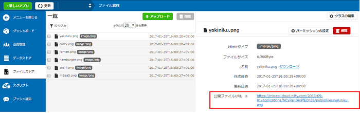
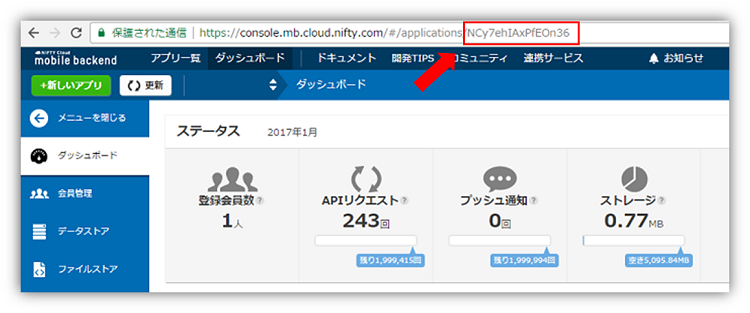
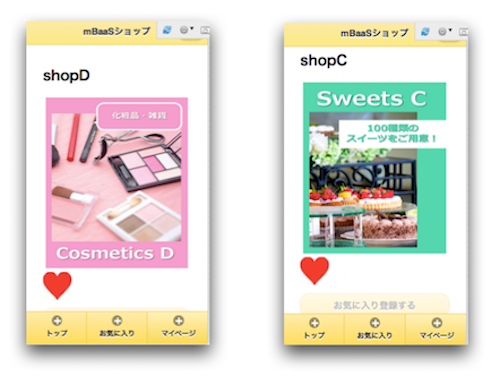
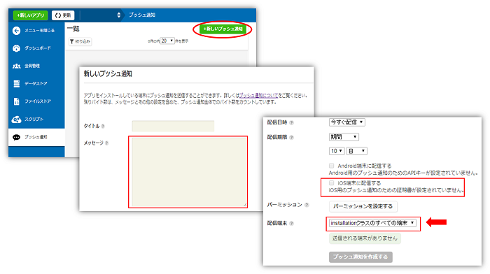
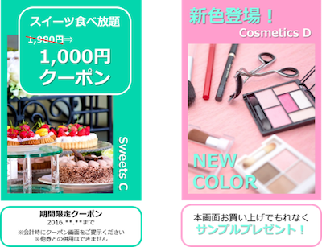

name: inverse
layout: true
class: center, middle, inverse
---
# <span style="font-size: 30%">【Monaca編】ニフティクラウドmobile backend レベルアップセミナー</span><br>__クーポン配信アプリ<br>を作ろう！__</span>

@ncmbadmin

.footnote[
20160817作成
]
---
layout: false
## 事前準備
ニフティクラウドmobile backendのアカウント登録がお済みでない方は、<br>
[ホームページ](http://mb.cloud.nifty.com/about.htm)右上にある「無料登録」ボタンをクリックして、<br>
アカウント登録を実施してください


---
## 今回のハンズオンセミナーについて
### セミナーの形式

.left-column[
  .center[
  150分でアプリ完成させます
  
  ]
]
.right-column[
  .center[
  講義形式で説明と演習を繰り返して<br>アプリを作成します<br><br>
  
  ]
]


---
## 今回のハンズオンセミナーについて
### 学ぶ内容

「mBaaS Shop List」アプリの作成を通して、アクティブユーザー率を上げる<br>
効率的なプッシュ通知の組み込み方を学びます

.center[

]

---
## 今回のハンズオンセミナーについて
### 学ぶ内容

「mBaaS Shop List」アプリの作成を通して、アクティブユーザー率を上げる<br>
効率的なプッシュ通知の組み込み方を学びます<br>

.center[

]

---
## 今回のハンズオンセミナーについて
### 学ぶ内容

「mBaaS Shop List」アプリの作成を通して、アクティブユーザー率を上げる<br>
効率的なプッシュ通知の組み込み方を学びます<br><br>

.center[

]

---
## ニフティクラウド mobile backendとは
### サービス紹介

* スマホアプリで汎用的に実装される機能を、クラウドサービスとして提供しているサービスです
 * 通称「mBaaS」と呼びます
* Monaca環境も対応しており、JavascriptSDKを利用することで上記の機能簡単実装できます。

.center[

]

---
## ニフティクラウド mobile backendとは
### Javascript SDKの特徴

* SDKのインストールが必要　（済み）
  * 今回は実装済み
  * 参考：[クイックスタート](http://mb.cloud.nifty.com/doc/current/introduction/quickstart_monaca.html)

---
## ニフティクラウド mobile backendとは
### Javascript SDKの特徴

* SDKの初期化処理が必要です
 * 後で処理を実装します

```js
var ncmb = new NCMB("YOUR_APPLICATIONKEY","YOUR_CLIENTKEY");
```

---
## ニフティクラウド mobile backendとは
### Javascript SDKの特徴

* サーバへリクエストする際、Javascriptは基本的に非同期処理として実行されます。
* 同期処理と非同期処理
 * 同期処理はその処理が完了するまで、次の処理が実行されません
 * 非同期処理はバックグラウンドで処理を実行し、次の処理を実行します(Javascript)

---
## ニフティクラウド mobile backendとは
### Javascript SDKの特徴

* SDKの代表利用例を紹介します。
    * オブジェクトを登録する
    * Promise形式で実装されています.
    * then, catchでそれぞれ成功／失敗の時の処理を定義します。

```js
// クラスのBookを作成
var Book = ncmb.DataStore("Book");

// データストアへの登録
var book = new Book();
book.set("message", "Hello, NCMB!");
book.save()
    .then(function(){
          // 保存に成功した場合の処理
    })
    .catch(function(err){
          // 保存に失敗した場合の処理
    });
```


---
## ハンズオンの概要
### 作成するアプリについて

* クーポン配信アプリをイメージした「mBaaS Shop List」アプリの作成を通して、mBaaSの機能を理解していきます
* mBaaSの連携部分をコーディングし、アプリを完成させ、次の内容を実現していきます
 * 会員登録をするとお店情報を見ることができます
 * お店のお気に入り登録ができ、お気に入り登録をしたお店からプッシュ通知で届きます
 * 性別や都道府県限定のプッシュ通知ができます
 * お店からのプッシュ通知でクーポンを直接配信することができます
 * 決まった時間に通知を出すようにプッシュ通知を仕掛けることができます

---
## ハンズオンの概要
### 作成するアプリについて

.center[

]

---
## ハンズオンの流れ

__<font color="#49a7e5" size="5">前半&nbsp;</font><font size="6">「mBaaS Shop List」アプリを作ろう！</font>__

.size_large[
1. ハンズオンの準備
1. 会員管理機能の作成
1. Shop情報の設定
1. お気に入り機能の作成
]

__<font color="#49a7e5" size="5">後半&nbsp;</font><font size="6">プッシュ通知を送ろう！</font>__
.size_large[
1. プッシュ通知の準備
1. プッシュ通知を送信：セグメント配信
1. プッシュ通知を送信：リッチプッシュ
1. プッシュ通知を送信：ペイロード
]

---
layout: true
class: center, middle, inverse_sub
---
#「mBaaS Shop List」<br>アプリを作ろう！

.size_large[
＜前半＞
]

---
layout: true
class: center, middle, inverse
---
# 1.ハンズオンの準備

---
layout: false
## ハンズオンの準備
### プロジェクトをダウンロード

下記リンクをクリックして、ZIPファイルでダウンロードしてください▼<br>
.size_large[
　　　 __[MonacaAdvancePush](https://github.com/ncmbadmin/MonacaAdvancePush/archive/handson_version.zip)__
]

* zipファイルを展開し、[Monaca](https://ja.monaca.io/)でプロジェクトをインポートします。

.center[

]

---
## ハンズオンの準備
### プロジェクトにあらかじめ実施していること

* mBaaSのJavascript SDKをインストール済み ( `Javascript SDK v.2.1.2` )
* mBaaSのプッシュ通知Cordovaプラグインをインストール済み ( `Monaca NCMB Push plugin v.2.0.2` )
* mBaaSとの連携以外の処理のコーディング
 * アプリのデザインを[jQuery Mobile](https://jquerymobile.com/)ベースで作成し、画面遷移、ボタン処理はコーディングしています( `index.html` )

---
## ハンズオンの準備
### mBaaSの準備

* [mBaaS](http://mb.cloud.nifty.com)にログインしてアプリを作成します


---
## ハンズオンの準備
### APIキーの設定とSDKの初期化

* `www/js/app.js`を開きます
* 一番最初に実行される処理を実装します
* 以下のコメントの直下に初期化コードを追加します。

BEFORE

```js:app.js
 // 【mBaaS】 APIキーの設定とSDKの初期化
```

AFTER

```js:app.js
 // 【mBaaS】 APIキーの設定とSDKの初期化
var appKey    = "YOUR_APP_KEY";
var clientKey = "YOUR_CLIENT_KEY";
var ncmb = new NCMB(appKey,clientKey);
```

---
## ハンズオンの準備
### APIキーの設定とSDKの初期化

* 初期化処理の「`YOUR_APP_KEY`」，「`YOUR_CLIENT_KEY`」の部分をアプリ作成時に発行されたAPIキーに書き換えてください
 * APIキーは、mBaaSのダッシュボードから「アプリ設定」→「基本」にあります

.center[

]

---
layout: true
class: center, middle, inverse
---
# 2.会員管理機能の作成

---
layout: false
## 会員管理機能の作成
### mBaaSの設定

* 会員管理設定の「メールアドレス/パスワード認証」を許可します
    * 「許可する」と選択し、保存します。


---
## 会員管理機能の作成

### 会員管理①：会員登録用メールを要求する[実装済み]

.center[

]


---
## 会員管理機能の作成
### 会員管理①：会員登録用メールを要求する[実装済み]

HTMLフォームコードは `index.html`にて確認できます。

```html:index.html
    <!-- [2 SIGNUP] 会員ログインリクエストページ -->
    <div data-role="page" id="SignupPage" data-theme="t">
    <header data-role="header" data-position="fixed" data-theme="t">
        <h1>mBaaSショップ</h1>
    </header>
        <section data-role="content">
        <h1>新規登録</h1>    
      メールアドレス
        <input type="text" id="signup_mailaddress">  
        <a href="#" id="SignupBtn" data-role="button" data-inline="false" data-theme="e">送信</a>
        <a href="#LoginPage" data-role="button" data-mini="true" data-inline="true" data-theme="e">戻る</a>
      </section>
    </div>
```


---
## 会員管理機能の作成
### 会員管理①：会員登録用メールを要求する[実装済み]

* `app.js`の`onSignupBtn()`を開きます
* 会員登録処理を実装します[実装済み]

```js:app.js
    // 【mBaaS：会員管理①】会員登録用メールを要求する
    var mailaddress = $("#signup_mailaddress").val();
    ncmb.User.requestSignUpEmail(mailaddress)
         .then(function(data){
            // 会員登録用メールの要求成功時の処理
         })
         .catch(function(err){
            // 会員登録用メールの要求失敗時の処理
         });
```

---
## 会員管理機能の作成
### 会員管理①：会員登録用メールを要求する[実装済み]

* それぞれ処理を追記しています[実装済み]

成功時の処理

```js
            // 会員登録用メールの要求成功時の処理
            alert("リクエストを送信しました！メールをご確認ください。");
            $.mobile.changePage('#LoginPage');
```

失敗時の処理

```js
            // 会員登録用メールの要求失敗時の処理
            alert("リクエスト失敗！次のエラー発生: " + err);
            $.mobile.changePage('#LoginPage');
```

---
## 会員管理機能の作成
### 会員管理②：メールアドレスとパスワードでログイン<br>[実装済み]

.center[

]

---
## 会員管理機能の作成
### 会員管理②：メールアドレスとパスワードでログイン<br>[実装済み]

HTMLフォームコードは `index.html`にて確認できます。

```html:index.html
    <!-- [1 LOGIN] ログインページ -->
    <div data-role="page" id="LoginPage" data-theme="t">
        <header data-role="header" data-position="fixed" data-theme="e">
            <h1>mBaaSショップ</h1>
        </header>
        <section data-role="content">
            <center><h1>mBaaSショップ</h1></center>
                メールアドレス
            <input type="text" id="login_mailaddress">
                パスワード
            <input type="password" id="login_password">
                新規登録？
            <a href="#SignupPage" data-role="button" data-mini="true" data-inline="true" data-theme="e">会員登録</a>
            <a href="#" id="LoginBtn" data-role="button" data-inline="false" data-theme="e">ログイン</a>
        </section>
    </div>
```

---
## 会員管理機能の作成
### 会員管理②：メールアドレスとパスワードでログイン<br>[実装済み]

* `app.js`の`onLoginBtn()`を開きます
* ログイン処理を実装します[実装済み]

```js:app.js
    //【mBaaS：会員管理②】メールアドレスとパスワードでログイン
    // 入力したメールアドレスの値
    var mailaddress = $("#login_mailaddress").val();
    // 入力したパスワードの値
    var password = $("#login_password").val();

    // メールアドレスとパスワードでログイン処理実施
    ncmb.User.loginWithMailAddress(mailaddress, password)
        .then(function(user) {
            // ログイン成功時の処理
        })
        .catch(function(error) {
            // ログイン失敗時の処理
        });
```

---
## 会員管理機能の作成
### 会員管理②：メールアドレスとパスワードでログイン<br>[実装済み]

* それぞれ処理を追記しています

成功時の処理

```js
            // ログイン成功時の処理
            alert("ログイン成功");
            currentLoginUser = ncmb.User.getCurrentUser();
            if(currentLoginUser.nickname) {
                showShopList();
            } else {
                // ユーザ情報登録画面遷移
                $.mobile.changePage('#RegisterPage');
            }
```

失敗時の処理

```js
            // ログイン失敗時の処理
            alert("ログイン失敗！次のエラー発生: " + error);
```

---
## 会員管理機能の作成
### 動作確認(1)ログインをしてみましょう

* デバッグについて（プッシュ通知がない場合）
  * 方法１（monacaデバッガーツール） [iOS](https://itunes.apple.com/jp/app/monaca/id550941371?mt=8) & [Android](https://play.google.com/store/apps/details?id=mobi.monaca.debugger&hl=ja)を利用

 .center[
 
 ]

---
## 会員管理機能の作成
### 動作確認(1)ログインをしてみましょう

* デバッグについて（プッシュ通知がない場合）
 * 方法２（monaca IDEのプレビュー機能を利用）

 .center[
 
 ]

---
## 会員管理機能の作成
### 動作確認(1)ログインをしてみましょう

* ログイン画面で「会員登録」をタップします
* 会員登録画面でメールアドレスを入力し、「登録メールを送信」をタップします

.center[

]

---
## 会員管理機能の作成
### 動作確認(1)ログインをしてみましょう

* 会員登録メールが届くので、パスワード設定します

.center[

]

---
## 会員管理機能の作成
### 動作確認(1)ログインをしてみましょう

* 再びログイン画面に戻り「メールアドレス」と「パスワード」でログインします
 * ログを確認してください
* mBaaSのダッシュボードを確認してください
 * 会員管理にユーザーが登録されました

.center[

]
.footnote[
[エラーコード一覧](http://mb.cloud.nifty.com/doc/current/rest/common/error.html#REST%20API%E3%81%AE%E3%82%A8%E3%83%A9%E3%83%BC%E3%82%B3%E3%83%BC%E3%83%89%E3%81%AB%E3%81%A4%E3%81%84%E3%81%A6)
]

---
## 会員管理機能の作成
### 会員管理③：ユーザー情報更新

.center[

]

---
## 会員管理機能の作成
### 会員管理③：ユーザー情報更新

HTMLフォームコードは `index.html`にて確認できます。

```html:index.html
  <!-- [3 REGISTER] 会員登録ページ -->
  <div data-role="page" id="RegisterPage" data-theme="t">
    <header data-role="header" data-position="fixed" data-theme="e">
        <h1>mBaaSショップ</h1>
    </header>
        <section data-role="content">
        <h1>新規会員登録</h1>
      ニックネーム
        <input type="text" id="reg_nickname">
        <div class="ui-field-contain">
            <fieldset data-role="controlgroup">
              <legend>性別</legend>
              <input id="reg_male" name="reg_gender" type="radio" value="男性" />
              <label for="reg_male">男性</label>
              <input id="reg_female" name="reg_gender" type="radio" value="女性" />
              <label for="reg_female">女性</label>
            </fieldset>
        </div>
      都道府県
        <input type="text" id="reg_prefecture">
        <a href="#" id="RegisterBtn" data-role="button" data-inline="false" data-theme="e">登録</a>
      </section>
  </div>
```

---
## 会員管理機能の作成
### 会員管理③：ユーザー情報更新


* `app.js`の`onRegisterBtn()`を開きます
* 初回のみ表示されるユーザー情報登録画面に入力した情報をmBaaSのユーザー情報に追加する処理を実装します
 * 以下のコメントの直下にコードを追加します。

BEFORE

```js:app.js
     //【mBaaS：会員管理③】ユーザー情報更新-
```


---
## 会員管理機能の作成
### 会員管理③：ユーザー情報更新

AFTER

```js:app.js
    //【mBaaS：会員管理③】ユーザー情報更新-
    //入力フォームからnickname, prefecture, genderを値セット
    var nickname = $("#reg_nickname").val();
    var prefecture = $("#reg_prefecture").val();
    var gender = $('input[name=reg_gender]:checked').val();

    // currentLoginUserユーザー情報を設定
    currentLoginUser.nickname = nickname;
    currentLoginUser.prefecture = prefecture;
    currentLoginUser.gender = gender;
    currentLoginUser.favorite = [];

    // user情報の更新
    currentLoginUser.update()
                    .then(function(user) {
                         // 更新成功時の処理
                    })
                    .catch(function(error) {
                        // 更新失敗時の処理
                    });
```

---
## 会員管理機能の作成
### 会員管理③：ユーザー情報更新

* それぞれ処理を追記します

更新成功時の処理

```js
     // 更新成功時の処理
     // 【mBaaS：プッシュ通知②】installationにユーザー情報を紐づける
     alert("会員情報登録に成功");
     //お店一覧画面遷移
     showShopList();
```

更新失敗時の処理

```js
     // 更新失敗時の処理
     alert("会員情報登録に失敗！次のエラー発生：" + error);
```

---
## 会員管理機能の作成
### 動作確認②: ユーザー情報更新

* 会員情報を入力し、登録しましょう。


---
## 会員管理機能の作成
### 動作確認②: ユーザー情報更新

* 登録した情報を確認ページでみてみましょう


---
layout: true
class: center, middle, inverse
---
# 3.Shop情報の設定

---
layout: false
## Shop情報の設定
### mBaaSにShop情報を用意する（データストア）

* 以下の手順でデータストアに「Shop」という名前のクラスを作成します
 * ニフティクラウド mobile backendのダッシュボードから「データストア」を開く
 * 「＋作成▼」ボタンをクリックし、「インポート」をクリックします
 * クラス名に「__Shop__」と入力します
 * ダウンロードしたプロジェクトにあるSettingフォルダ内の「__Shop.json__」を選択してアップロードします

.center[

]

---
## Shop情報の設定
### mBaaSにShop情報を用意する（データストア）

ダッシュボードでデータがインポートされていることを確認しましょう。

.center[

]

---
## Shop情報の設定
### mBaaSにShop情報を用意する（ファイルストア）

* 以下の手順で各icon・Shop画面・リッチプッシュで使用する画像をmBaaSに設定します
 * 「ファイルストア」を開き、「↑アップロード」ボタンをクリックします
 * ダウンロードしたサンプルプロジェクトにあるSettingフォルダ内の「icon」「Shop」「Sale」内にあるファイルをすべてをアップロードします

.center[

]

---
## Shop情報の設定
### mBaaSにShop情報を用意する（ファイルストア）

* ファイルストアでファイルがアップロードされていることを確認しましょう。

.center[

]


---
## Shop情報の設定
### データストア：「Shop」クラスのデータを取得

* これからデータストアに入っているショップデータの取得を実装していきます。


---
## Shop情報の設定
### データストア：「Shop」クラスのデータを取得

HTMLフォームコードは `index.html`にて確認できます。

```html:index.html
 <!-- [5 TOP] メインページ -->
  <div data-role="page" id="TopPage" data-theme="t">
  <-- 省略 -->
        <ul data-role="listview" data-theme="e" id="listShop"  >
        </ul>
  <-- 省略 -->
  </div>
```


---
## Shop情報の設定
### データストア：「Shop」クラスのデータを取得

* `app.js`の`showShopList()`を開きます
* インポートしたShopクラスのデータを取得する処理を実装します

BEFORE

```js:app.js
    //【mBaaS：データストア】「Shop」クラスのデータを取得
```

AFTER

```js:app.js
    // 【mBaaS：データストア】「Shop」クラスのデータを取得
    // 「Shop」クラスのクエリを作成
    var ShopClass = ncmb.DataStore("Shop");

    //  データストアを検索
    ShopClass.fetchAll()
        .then(function(shops) {
            // 検索成功時の処理
        })
        .catch(function(error) {
            // 検索失敗時の処理
        });
```

---
## Shop情報の設定
### データストア：「Shop」クラスのデータを取得

* それぞれ処理を追記します

検索成功時の処理

```js
            // 検索成功時の処理
            shopList = convertShopList(shops);

            // shopArrayに取得しやすいショップのobjectIdと「Shop」クラスの情報を保持
            shopArray = shops;

            // listShopの内容を設定
            for (var i = 0; i < shops.length; i++) {
                var shop = shops[i];
                var tmpStr = '<li class="ui-li-has-thumb"><a id="ShopBtn" href="#" onclick="showShopDetail(\'' + shop.objectId + '\');">'
            + shop.name + '</a></li>';
                $("#listShop").append(tmpStr);
            }

            // listShopの内容を更新
            $('#listShop').listview('refresh');
```

---
## Shop情報の設定
### データストア：「Shop」クラスのデータを取得

* それぞれ処理を追記します

検索失敗時の処理

```js
            // 検索失敗時の処理
            alert(error.message);
```

---
## Shop情報の設定
### ファイルストア：icon画像の取得

.center[

]

---
## Shop情報の設定
### ファイルストア：icon画像の取得

* 今回の実装は公開ファイル機能を利用して、アプリの画像を取得します
* 公開ファイルとは
    * 「公開ファイル」機能とは、ファイルストアに保存した画像をリンクでアクセスできるようにする機能です
*  ファイルストアに登録した画像を「公開ファイル」にする必要があります

---
## Shop情報の設定
### ファイルストア：icon画像の取得

* mBaaSのダッシュボードで、公開ファイル設定「HTTPでの取得」を有効にします

.center[

]

---
## Shop情報の設定
### ファイルストア：icon画像の取得

公開ファイルURL確認方法

* ファイルストアで公開ファイルURLを確認できます

```
https://mb.api.cloud.nifty.com/2013-09-01/applications/[アプリケID]/publicFiles/[ファイル名]
```

.center[

]

---
## Shop情報の設定
### ファイルストア：icon画像の取得

* `app.js`の「YOUR_APP_ID」をmBaaSのアプリケーションIDに書き換えます
* 「ダッシュボード」を選択し、URLから「YOUR_APP_ID」を確認してください。

```js:app.js
var applicationID = "YOUR_APP_ID";
```



---
## Shop情報の設定
### ファイルストア：icon画像の確認

.center[

]

---
## Shop情報の設定
### ファイルストア：Shop画面画像の取得

上記同様、ショップ詳細画像の表示を実装します。




---
## Shop情報の設定
### ファイルストア：Shop画像の取得

* `app.js`の`showShopDetail()`を開きます
* Shop画面に各ショップの画像をmBaaSから取得して表示する処理を実装します

BEFORE

```js:app.js
   // 【mBaaS：ファイルストア②】Shop画像の取得
```

---
## Shop情報の設定
### ファイルストア：Shop画像の取得

AFTER

```js:app.js
   // 【mBaaS：ファイルストア②】Shop画像の取得
   currentShopId = shopId;
   var shopTmp = shopList[shopId];
   $("#shopName").text(shopTmp.name);
   $("#shopImage").attr("src" , publicFileUrl + shopTmp.shop_image);
   // お気に入り登録されている場合の表示設定
   if (currentLoginUser.favorite.indexOf(shopId) >= 0) {
        //お気に入り登録された場合の♥︎表示
        $("#favoriteImage").attr("src" , "images/favorite.png");
        //お気に入り登録ボタンを非アクティブ表示
        $("#FavoriteBtn").addClass('ui-disabled');
   }else{
        //お気に入り登録された場合の♡表示
        $("#favoriteImage").attr("src" , "images/nofavorite.png");
        //お気に入り登録ボタンをアクティブ表示
        $("#FavoriteBtn").removeClass('ui-disabled');
   }
```

---
## Shop情報の設定
### 動作確認(2)会員情報登録とShop情報表示_

* トップ画面が表示されます
  * このとき、 画面に「icon画像」「Shop名」が表示されます
* Shopを１つ選んでタップします
  * mBaaSに登録されているimageにアクセスし、Shopページ（画像）が表示されます
* 会員ページをタップします
  * 初回登録画面で登録した内容と、ログイン用のアドレスを表示しています

.center[

]
.footnote[
[エラーコード一覧](http://mb.cloud.nifty.com/doc/current/rest/common/error.html#REST%20API%E3%81%AE%E3%82%A8%E3%83%A9%E3%83%BC%E3%82%B3%E3%83%BC%E3%83%89%E3%81%AB%E3%81%A4%E3%81%84%E3%81%A6)
]

---
## Shop情報の設定
### 動作確認(2)会員情報登録とShop情報表示

* トップ画面に「icon画像」「Shop名」「カテゴリ」が表示されます
* Shopを１つ選んでタップします
 * mBaaSに登録されているimageにアクセスし、Shopページ（画像）が表示されます
* 会員ページをタップします
 * ユーザー情報が表示されます

.center[

]
.footnote[
[エラーコード一覧](http://mb.cloud.nifty.com/doc/current/rest/common/error.html#REST%20API%E3%81%AE%E3%82%A8%E3%83%A9%E3%83%BC%E3%82%B3%E3%83%BC%E3%83%89%E3%81%AB%E3%81%A4%E3%81%84%E3%81%A6)
]

---
layout: true
class: center, middle, inverse
---
# 4.お気に入り機能の作成

---
layout: false
## お気に入り機能の作成
### お気に入り機能について

* お気に入り機能は好きなShopをお気に入りとして保存できる機能です
 * 「お気に入り」画面ではSwitchと「登録」ボタンで設定します
 * 「Shop」画面では「お気に入りを登録する」をタップすることでShop単位で設定できます

.center[

]

---
## お気に入り機能の作成
### 会員管理④：ユーザー情報の更新[実装済み]

* `FavoriteActivity.java`を開きます
* `doFavoriteSave()`を開きます
* お気に入り画面からfavoriteデータの更新処理はユーザー情報の登録と同様にして実装できます

---
## お気に入り機能の作成
### 会員管理④：ユーザー情報の更新[実装済み]


```java
//**************** 【mBaaS/User ④: 会員情報更新】***************
List<String> list = new ArrayList<String>();
list = common.currentUser.getList("favorite");
common.currentUser.put("favorite", list);
common.currentUser.saveInBackground(new DoneCallback() {
    @Override
    public void done(NCMBException e) {
        if (e != null) {
            //保存失敗時の処理
            <<省略>>
        } else {
            //保存成功時の処理
            new AlertDialog.Builder(FavoriteActivity.this)
                    .setTitle("Notification from Nifty")
                    .setMessage("お気に入り保存成功しました!")
                    .setPositiveButton("OK", new DialogInterface.OnClickListener() {
                        public void onClick(DialogInterface dialog, int which) {
                            Intent intent = new Intent(getApplicationContext(), FavoriteActivity.class);
                            startActivityForResult(intent, REQUEST_RESULT);
                        }
                    })
                    .show();
        }
    }
});
```

---
## お気に入り機能の作成

### 会員管理⑤：ユーザー情報の更新[実装済み]

* `ShopActivity.java`を開きます
* `doFavoriteRegister()`を開きます
* Shop画面からもfavoriteデータの更新処理はユーザー情報の登録と同様にして実装できます

---
## お気に入り機能の作成

### 会員管理⑤：ユーザー情報の更新[実装済み]


```java
//**************** 【mBaaS/User⑤: 会員情報更新】***************
List<String> list = new ArrayList<String>();
list = common.currentUser.getList("favorite");
list.add(objId);
common.currentUser.put("favorite", list);
common.currentUser.saveInBackground(new DoneCallback() {
    @Override
    public void done(NCMBException e) {
        if (e != null) {
            //更新失敗時の処理
            <<省略>>
        } else {
            //更新成功時の処理
          　<<省略>>
        }
    }
});
```

---
## お気に入り機能の作成
### 動作確認(3)お気に入り情報登録・更新

* 再びシュミレーターでビルドし、動作確認を行います
* ログイン後トップ画面下の「お気に入り」をタップします
* お気に入り画面からお気に入り登録をしてみましょう
* 各Shop画面からも同様に登録してみましょう
 * ログを確認してください

.center[

]

.footnote[
[エラーコード一覧](http://mb.cloud.nifty.com/doc/current/rest/common/error.html#REST%20API%E3%81%AE%E3%82%A8%E3%83%A9%E3%83%BC%E3%82%B3%E3%83%BC%E3%83%89%E3%81%AB%E3%81%A4%E3%81%84%E3%81%A6)
]

---
layout: true
class: center, middle, inverse_sub
---
# プッシュ通知を送ろう！

.size_large[
＜後半＞
]

---
layout: true
class: center, middle, inverse
---
# 1.プッシュ通知の準備

---
layout: false
## プッシュ通知の準備
### このあとのデバッグについて

* 以下の用意が必要です
 * デバッグ用のAndroid実機 (4.0~)
 * GCMのプッシュ通知用APIキー
* GCMのプッシュ通知用APIキーがまだの場合は下記をご参照ください
 * [【サンプル】アプリにプッシュ通知を組み込もう！](https://github.com/NIFTYCloud-mbaas/android_push_demo#%E6%89%8B%E9%A0%86)

---
## プッシュ通知の準備
### mBaaSの設定

* プッシュ通知の許可を行います
* GCMのプッシュ通知用APIキーを設定します

.center[

]

---
## プッシュ通知の準備
### プッシュ通知①：端末を登録

* `MainActivity.java`を開きます
* `onCreate()`メソッド内のSDKの初期化を実装した部分の直ぐ下に処理を実装します

```java
//**************** 【mBaaS/Push①: 端末を登録】***************

```

---
## プッシュ通知の準備
### プッシュ通知①：端末を登録

```java
//**************** 【mBaaS/Push①: 端末を登録】***************
//端末情報を扱うNCMBInstallationのインスタンスを作成する
final NCMBInstallation installation = NCMBInstallation.getCurrentInstallation();
//GCMからRegistrationIdを取得しinstallationに設定する
installation.getRegistrationIdInBackground("PROJECT_NUMBER", new DoneCallback() {
    @Override
    public void done(NCMBException e) {
        if (e == null) {
            installation.saveInBackground(new DoneCallback() {
                @Override
                public void done(NCMBException e) {
                    if(e == null){
                        Log.d(TAG, "端末情報を保存成功しました。");
                    }else if(NCMBException.DUPLICATE_VALUE.equals(e.getCode())){
                        //保存失敗 : registrationID重複
                        updateInstallation(installation);
                    }else {
                        Log.d(TAG, "端末情報を保存失敗しました。");
                    }
                }
            });
        } else {
        }
    }
});
```

---
## プッシュ通知の準備
### プッシュ通知①：端末を登録

* 前のスライドのコードにある`PROJECT_NUMBER`の設定を行います。

.center[

]

---
layout: true
class: center, middle, inverse
---
# 2.プッシュ通知を送信<br>セグメント配信

---
layout: false
## プッシュ通知を送信：セグメント配信
### プッシュ通知②：installationにユーザー情報を紐づける

* `RegisterActivity.java`を開きます
* 「【mBaaS/User③: ユーザー情報更新】」の更新成功時の処理内にセグメント配信のために必要なユーザー情報をinstallationに紐付けるための処理を実装します


```java
//**************** 【mBaaS：プッシュ通知②】installationにユーザー情報を紐づける ***************

```

---
## プッシュ通知を送信：セグメント配信
### プッシュ通知②：installationにユーザー情報を紐づける

* 次のように追記します

```java
//**************** 【mBaaS：プッシュ通知②】installationにユーザー情報を紐づける ***************
NCMBInstallation currInstallation  = NCMBInstallation.getCurrentInstallation();
currInstallation.put("prefecture", prefecture);
currInstallation.put("gender", selectedGender);
currInstallation.put("favorite", list);
currInstallation.saveInBackground(new DoneCallback() {
    @Override
    public void done(NCMBException e) {
        if (e != null) {
            //更新失敗時の処理
        } else {
            //更新成功時の処理
        }
    }
});
```

---
## プッシュ通知を送信：セグメント配信
### プッシュ通知②：installationにユーザー情報を紐づける

* それぞれ処理を追記します

```java
//更新失敗時の処理
Log.d(TAG, "端末情報を保存失敗しました。");
```

```java
//更新成功時の処理
Log.d(TAG, "端末情報を保存成功しました。");
Intent intent = new Intent(getApplicationContext(), MainActivity.class);
startActivityForResult(intent, REQUEST_RESULT );
```

---
## プッシュ通知を送信：セグメント配信
### プッシュ通知③：installationにユーザー情報を紐づける<br>[実装済み]

* `FavoriteActivity.java`開きます
* `doFavoriteSave()`を開きます
* 同様に、お気に入り画面でお気に入り情報が更新されるたびに、installation情報が書き換えられます

```java
//**************** 【mBaaS：プッシュ通知④】installationにユーザー情報を紐づける***************
//端末情報を保存する
NCMBInstallation currInstallation = NCMBInstallation.getCurrentInstallation();
currInstallation.put("favorite", list);
currInstallation.saveInBackground(new DoneCallback() {
    @Override
    public void done(NCMBException e) {
        if (e != null) {
            //保存失敗
            Log.d(TAG, "端末情報を保存失敗しました。");
        } else {
            //保存成功
            Log.d(TAG, "端末情報を保存成功しました。");
        }
    }
});
```

---
## プッシュ通知を送信：セグメント配信
### プッシュ通知④：installationにユーザー情報を紐づける<br>[実装済み]

* `ShopActivity.java`開きます
* `doFavoriteRegister()`開きます
* 同様に、Shop画面でもお気に入り情報が更新されるたびに、installation情報が書き換えられます

```java
//****************【mBaaS：プッシュ通知⑤】installationにユーザー情報を紐づける***************
NCMBInstallation currInstallation  = NCMBInstallation.getCurrentInstallation();
currInstallation.put("favorite", list);
currInstallation.saveInBackground(new DoneCallback() {
    @Override
    public void done(NCMBException e) {
        if (e != null) {
            //保存失敗した場合の処理
            Log.d(TAG, "端末情報を保存失敗しました。");
        } else {
            //保存成功した場合の処理
            Log.d(TAG, "端末情報を保存成功しました。");
        }
    }
});
```
---
## プッシュ通知を送信：セグメント配信
### 動作確認の準備

* もう一度会員情報登録画面を表示するため、mBaaSの会員管理画面で「クラスの編集」をクリックします
* 「nickname」にチェックを入れて上の「削除」ボタンで削除します

.center[

]

---
## プッシュ通知を送信：セグメント配信
### 動作確認の準備

* 実機でアプリをビルドします
* アプリを起動します

```text
端末情報を保存成功しました。
```

* デバイストークンの取得に成功したら、mBaaSダッシュボードで確認します

.center[

]

.footnote[
[エラーコード一覧](http://mb.cloud.nifty.com/doc/current/rest/common/error.html#REST%20API%E3%81%AE%E3%82%A8%E3%83%A9%E3%83%BC%E3%82%B3%E3%83%BC%E3%83%89%E3%81%AB%E3%81%A4%E3%81%84%E3%81%A6)
]

---
## プッシュ通知を送信：セグメント配信
### 動作確認の準備

* ログインをし、再びユーザー登録をします
 * このとき、installationが更新されますのでダッシュボードを確認します
 * ログを確認してください

.center[

]
.footnote[
[エラーコード一覧](http://mb.cloud.nifty.com/doc/current/rest/common/error.html#REST%20API%E3%81%AE%E3%82%A8%E3%83%A9%E3%83%BC%E3%82%B3%E3%83%BC%E3%83%89%E3%81%AB%E3%81%A4%E3%81%84%E3%81%A6)
]

---
## プッシュ通知を送信：セグメント配信
### 動作確認(4)セグメント配信

__shopB__をお気に入り登録しているユーザーに絞り込んでプッシュ通知を配信してみましょう！

* あらかじめshopBをお気に入りに設定しておきます(アプリ側)
* mBaaSのダッシュボードからShopクラスのデータを開き、shopBの「objectId」をコピーします

.center[

]

---
## プッシュ通知を送信：セグメント配信
### 動作確認(4)セグメント配信

* プッシュ通知を作成します
* メッセージを入力します
 * 例：ShopBセール開催中！
* 「Android端末に配信する」にチェックを入れます
* 「配信端末」を設定します

.center[

]

---
## プッシュ通知を送信：セグメント配信
### 動作確認(4)セグメント配信

* 「installationクラスからの絞込み」を選択します
* 絞り込み設定をします
 * ここでコピーしたShopBのobjectIdを貼り付けます

.center[

]

---
## プッシュ通知を送信：セグメント配信
### 動作確認(4)セグメント配信

* 「１端末に向けて送信されます」と表示されればOKです
* 「プッシュ通知を作成する」をクリックします
* 少し待つと配信されます→端末を確認！

.center[

]

---
## プッシュ通知を送信：セグメント配信
### 動作確認(4)セグメント配信[おまけ]

.size_large[
いろいろなパターンで送ってみましょう！
* 別のショップを絞り込み
* 性別で絞込み
* ShopAをお気に入り登録かつ女性で絞込み
* ShopDをお気に入り登録かつ東京都で絞込み
* and more...
]

---
layout: true
class: center, middle, inverse
---
# 2.プッシュ通知を送信<br>リッチプッシュ

---
layout: false

## プッシュ通知を送信：リッチプッシュ
### リッチプッシュについて

* プッシュ通知登録時にURLを指定することで、開封時にWebビューを表示できる機能です
* プッシュ通知開封でアプリが起動するときに表示されます
 * アプリ起動中には表示されませんので動作確認にはアプリを閉じておく必要があります（仕様）

---
## プッシュ通知を送信：リッチプッシュ
### リッチプッシュについて

* 今回はShopのセール画像を「公開ファイル」機能を利用して配信します

.center[

]


---
## プッシュ通知を送信：リッチプッシュ
### 公開ファイルとは

* 「公開ファイル」機能とは、ファイルストアに保存した画像をリンクでアクセスできるようにする機能です
* ファイルストアに登録した画像を「公開ファイル」として公開することが可能です

---
## プッシュ通知を送信：リッチプッシュ
### 公開ファイル設定

* mBaaSのダッシュボードで、公開ファイル設定「HTTPでの取得」を有効にします

.center[

]

---
## プッシュ通知を送信：リッチプッシュ
### 公開ファイルURL確認方法

* ファイルストアで確認できます
* 今回は「ShopD_sale.png」の公開ファイルURLを使用してみます
 * URLをコピーします

.center[

]

---
## プッシュ通知を送信：リッチプッシュ
### 公開ファイルURL確認方法

* ブラウザでリンクをたたいて表示されることを確認してください

.center[

]

---
## プッシュ通知を送信：リッチプッシュ
### プッシュ通知⑥：リッチプッシュ通知を表示させる処理

* `MainActivity.java`を開きます
* `onResume()`を開きます
* 以下のコメントの直下にコードを追加します

```java
//**************** 【mBaaS：プッシュ通知⑥】リッチプッシュ通知を表示させる処理 ***************
```

* 次のように追記します

```java
//**************** 【mBaaS：プッシュ通知⑥】リッチプッシュ通知を表示させる処理 ***************
//リッチプッシュ通知の表示
NCMBPush.richPushHandler(this, getIntent());

//リッチプッシュを再表示させたくない場合はintentからURLを削除します
getIntent().removeExtra("com.nifty.RichUrl");
```

---
## プッシュ通知を送信：リッチプッシュ
### 動作確認(5)リッチプッシュ

* 実機でアプリをビルドします
* 起動した後にホームに戻ります


---
## プッシュ通知を送信：リッチプッシュ
### 動作確認(5)リッチプッシュ

* プッシュ通知を作成します
* メッセージを入力します
* URL欄にコピーした公開ファイルURLを貼り付けます
* そのまま送信してみましょう

.center[

]

---
## プッシュ通知を送信：リッチプッシュ
### 動作確認(5)リッチプッシュ

* しばらくするとプッシュ通知が届きます
* プッシュ通知を開くとWebView画面が現れ、公開ファイルが表示されます

.center[

]

---
layout: true
class: center, middle, inverse
---
# 2.プッシュ通知を送信<br>ペイロード

---
layout: false
## プッシュ通知を送信：ペイロード
### ペイロードについて

* プッシュ通知にはJSON形式で任意のデータを含めることができ、通知を受信した時に、そのデータを受け取って処理を行うことができる機能です
* 今回は、配信時間とメッセージのデータを設定し、時限式でローカルプッシュを表示させる内容を実装します
 * プッシュ通知に設定するJSON形式のデータの例
 ```text
 {"deliveryTime":"2016-09-22 17:00:00", "message":"タイムセールスタート！"}
 ```

---
## プッシュ通知を送信：ペイロード
### プッシュ通知⑦：アプリが起動中にプッシュ通知からデータを取得する

* Androidの場合、受信する処理をカスタマイズするために、カスタムサービスを作成する必要があります
* 今回、コード内にCustomGcmListenerServiceは作成済み
  - 作成に関して、実装方法はこちらのドキュメントをご参考ください。
  - [プッシュ通知でJSONデータを取得する](http://mb.cloud.nifty.com/doc/current/push/basic_usage_android.html#%E3%83%97%E3%83%83%E3%82%B7%E3%83%A5%E9%80%9A%E7%9F%A5%E3%81%A7JSON%E3%83%87%E3%83%BC%E3%82%BF%E3%82%92%E5%8F%96%E5%BE%97%E3%81%99%E3%82%8B)

---
## プッシュ通知を送信：ペイロード
### プッシュ通知⑦：アプリがプッシュ通知からデータを取得する

* `CustomGcmListenerService.java`を開きます
* `onMessageReceived()`メソッド外に次のメソッドを実装します

```java
//**************** 【mBaaS：プッシュ通知⑦】アプリがプッシュ通知からデータを取得する***************
```

---
## プッシュ通知を送信：ペイロード
### プッシュ通知⑦：アプリがプッシュ通知からデータを取得する

以下のように追記します

```java
//**************** 【mBaaS：プッシュ通知⑦】アプリが起動中にプッシュ通知からデータを取得する***************
//ペイロードデータの取得
if (data.containsKey("com.nifty.Data")) {
    try {
        JSONObject json = new JSONObject(data.getString("com.nifty.Data"));

        if (json.has("deliveryTime") && json.has("message")) {
            Log.d(TAG,"ペイロードを取得しました！");
            //ペイロード処理実装

        }

    } catch (JSONException e) {
        //エラー処理
    } catch (ParseException e) {
        e.printStackTrace();
    }
}
```

---
## プッシュ通知を送信：ペイロード
### プッシュ通知⑦：アプリがプッシュ通知からデータを取得する

* ペイロード処理実装します
* 指定した時間でローカルプッシュ通知を表示させます。

```java
//ペイロード処理実装
// 変換対象の日付文字列
String dateStr = json.getString("deliveryTime");
String message = json.getString("message");
SimpleDateFormat sdf = new SimpleDateFormat("yyyy-MM-dd HH:mm:ss");
// Date型変換
Date formatDate = sdf.parse(dateStr);
long triggerlMilli = formatDate.getTime();

//Local notification trigger
AlarmManager alarmManager = (AlarmManager) getSystemService(Context.ALARM_SERVICE);

Intent notificationIntent = new Intent("android.media.action.DISPLAY_NOTIFICATION");
notificationIntent.addCategory("android.intent.category.DEFAULT");
notificationIntent.putExtra("message", message);

PendingIntent broadcast = PendingIntent.getBroadcast(this, 100, notificationIntent, PendingIntent.FLAG_UPDATE_CURRENT);
alarmManager.setExact(AlarmManager.RTC_WAKEUP, triggerlMilli , broadcast);
```


---
## プッシュ通知を送信：ペイロード
### 動作確認(6)ペイロード（アプリ起動時）

* 実機でアプリをビルドします
* 起動し、下記ログを確認します

```text
端末情報を保存成功しました。
```

* そのままアプリを起動した状態にします

---
## プッシュ通知を送信：ペイロード
### 動作確認(6)ペイロード（アプリ起動時）

* プッシュ通知に設定するJSON形式のデータを作成します
 * JSONデータに設定する時間は、今から__５分以上未来の時間__に変更してください
 * JSONデータに設定するメッセージは、自由に変更してください
 ```text
 {"deliveryTime":"2016-09-29 17:00:00", "message":"タイムセールスタート！"}
 ```
 * 作成したらコピーをしておいてください

---
## プッシュ通知を送信：ペイロード
### 動作確認(6)ペイロード（アプリ起動時）

* プッシュ通知を作成します
 * メッセージを入力が無い場合、サイレントプッシュとして送られます
 * 「JSON」に作成したJSONデータを貼り付けます

.center[

]

---
## プッシュ通知を送信：ペイロード
### 動作確認(6)ペイロード（アプリ起動時）

* プッシュ通知を送信します
* プッシュ通知を受信（サイレント）すると次のログが表示されます

```text
ペイロードを取得しました！
```

* 指定時間にプッシュ通知が表示されることを確認してください

.footnote[
[エラーコード一覧](http://mb.cloud.nifty.com/doc/current/rest/common/error.html#REST%20API%E3%81%AE%E3%82%A8%E3%83%A9%E3%83%BC%E3%82%B3%E3%83%BC%E3%83%89%E3%81%AB%E3%81%A4%E3%81%84%E3%81%A6)
]
---
## プッシュ通知を送信：ペイロード
### 動作確認(6)ペイロード（非起動時）

* アプリを閉じます
* 再びプッシュ通知を作成します

.center[

]

---
## プッシュ通知を送信：ペイロード
### 動作確認(6)ペイロード（非起動時）

* アプリが起動していないので、サイレントプッシュでは気付いてもらえません
* アプリを起動してもらう内容でプッシュ通知を作成します
 * メッセージ　例）`明日PM5時よりタイムセールを行います！`
* JSON形式のデータを貼り付けます
 * JSONデータ作成　例）明日午後5時を設定
 ```text
 {"deliveryTime":"2016-09-30 17:00:00", "message":"タイムセールスタート！"}
 ```
 * 時間は今から５分以上未来の時間に変更してください

---
## プッシュ通知を送信：ペイロード
### 動作確認(6)ペイロード（非起動時）

* プッシュ通知を受信したら、プッシュ通知からアプリを起動します
* 起動時にデータを取得します
 * １度起動してあればアプリは閉じてもOKです
* 指定時間にプッシュ通知が表示されることを確認してください

---
layout: true
class: center, middle, inverse_sub
---
# まとめ

---
layout: false
## まとめ
### 学んだこと

* mBaaSの各機能を使用してアプリ作成方法を学んだ！
 * 会員管理機能
 * データストア
 * ファイルストア
 * プッシュ通知
* プッシュ通知の活用方法がわかった！
 * セグメント配信
 * リッチプッシュ
 * ペイロード

---
## 参考

* 開催中の[セミナー](https://ncmb.doorkeeper.jp/)のご案内
 * 随時新しいセミナーを実施していきますのでぜひチェックしてください！
* ハンズオン内容が実装された完全版プロジェクト
 * __[AndroidAdvancePush【完成版】](https://github.com/ncmbadmin/AndroidAdvancePush/archive/master.zip)__
* コードは[GitHub](https://github.com/ncmbadmin/AndroidAdvancePush)に公開しています
 * __master__：完成版
 * __handson__：セミナー版
